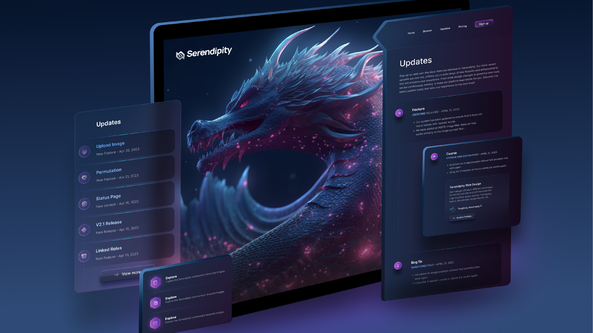

# Serendipity 🎀

</img>

## En práctica ⚔️

- La idea es lograr hacer algo lo mas parecido posible al diseño presentado en figma.

## Construido con 🔨

- HTML5
- CSS3

## Falta ⏳

- Retormarlo en un futuro

## Recursos 📌

- [Modelo Figma](https://www.figma.com/file/YWQzQfLV3AJYDnr5EXUP3D/Notification-Web-Design-(Community)?mode=dev)